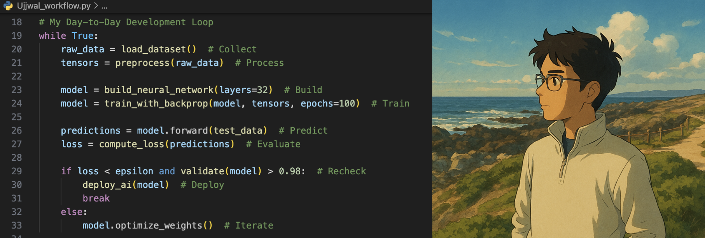

<h3 align="center">☁️ Cloud Technologies </h3>

  
  
  

<h3 align="center">⌨️ Programming Languages</h3>

  
  
  
  
  
  
  
  

<h3 align="center">💻 AI/ML & Data Science </h3>

  
  
  
  
  
  
  
  
  
  
 
 

<h3 align="center">🎧 Using & Learning </h3>

  
  
  
  
  
  
  
  
  

<h2 align="center"> Thanks for stopping by, I'm happy to connect! 

  
  &nbsp;&nbsp;
  
  

</h2>

