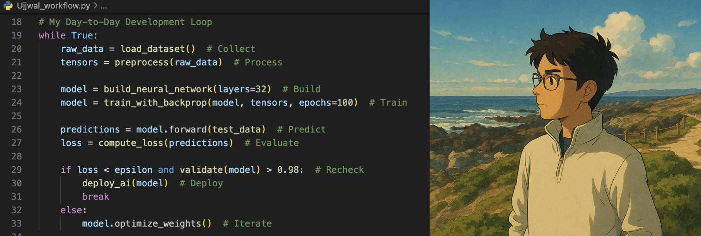

  

<h3 align="center">☁️ Cloud Technologies</h3>

  <table border="0"><tr>
    <td align="center"></td>
    <td align="center"></td>
    <td align="center"></td>
  </tr></table>

<h3 align="center">⌨️ Programming Languages</h3>

  <table border="0"><tr>
    <td align="center"></td>
    <td align="center"></td>
    <td align="center"></td>
    <td align="center"></td>
    <td align="center"></td>
    <td align="center"></td>
  </tr></table>

<h3 align="center">💻 AI/ML & Data Science</h3>

  <table border="0"><tr>
    <td align="center"></td>
    <td align="center"></td>
    <td align="center"></td>
    <td align="center"></td>
    <td align="center"></td>
    <td align="center"></td>
    <td align="center"></td>
    <td align="center"></td>
    <td align="center"></td>
    <td align="center"></td>
    <td align="center"></td>
  </tr></table>

<h3 align="center">🎧 Using & Learning</h3>

  <table border="0"><tr>
    <td align="center"></td>
    <td align="center"></td>
    <td align="center"></td>
    <td align="center"></td>
    <td align="center"></td>
    <td align="center"></td>
    <td align="center"></td>
    <td align="center"></td>
    <td align="center"></td>
  </tr></table>

<h3 align="center">  Thanks for stopping by, I'm happy to connect!   </h3>

  <table border="0"><tr>
    <td align="center"></td>
    <td align="center"></td>
    <td align="center"></td> </tr> 
 

  

    

